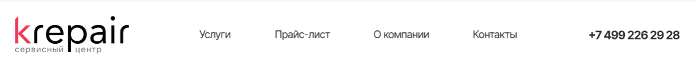
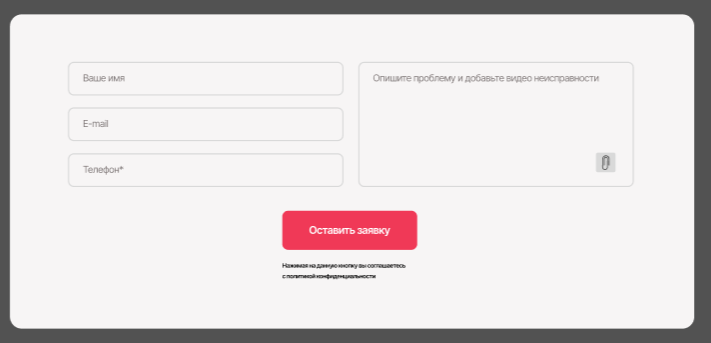
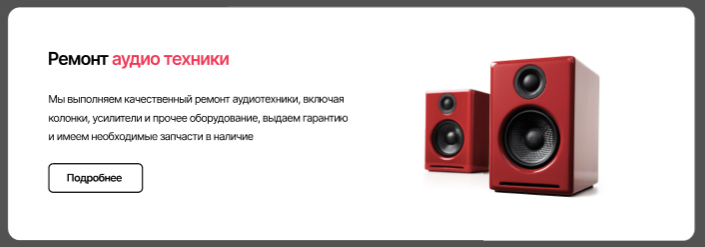
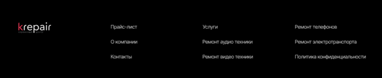

# Лабораторная работа №1, BEM
## Задание №1
голова
голова__бровь
голова__бровь_проколотая

голова
голова__глаз
голова__глаз_закрыт

голова
голова__лицо
голова__лицо_накрашенное

туловище
туловище__рука
туловище__рука_правая

туловище
туловище__живот
туловище__живот_плоский

туловище
туловище__грудь
туловище__грудь_накаченная

нога
нога__палец
нога__палец_большой

нога
нога__икра
нога__игра_накаченная

нога
нога__ступня
нога__ступня_мягкая

## Задание №2
### Header

`header.header>.container>a.header__logo^nav.header__nav>ul.header__list>li.header__item*5^a.header__aside`

### Form

`form.feedback-form>.feedback-form__content>.feedback-form__content_column1>input:text+input:email+input:tel^.feedback-form__content_column2>textarea>img.feedback-form__icon^^button.button.feedback-form__button+a.feedback-form__text`

### Card

`div.card>.card__info>h3.card__title+p.card__description+a.card__link^img.card__img`

### Footer

`header.header>.container>a.footer__logo^(nav.footer__nav_column$>ul.header__list>li.header__item*3)*3`